# Customer Churn Prediction — Project Summary

## Overview

This project builds and evaluates machine learning models to predict customer churn for a telecommunications provider. The dataset contains **3,333 customers**, of whom **483 (14.5%) churned** and **2,850 (85.5%) were retained**. The goal is to identify at-risk customers early enough to enable proactive retention efforts.

---

## Dataset Summary

| Metric | Value |
|---|---|
| Total customers | 3,333 |
| Churned | 483 (14.5%) |
| Retained | 2,850 (85.5%) |
| Class imbalance | ~6:1 (retained:churned) |

---

## Data Analysis

### Churn Rate 
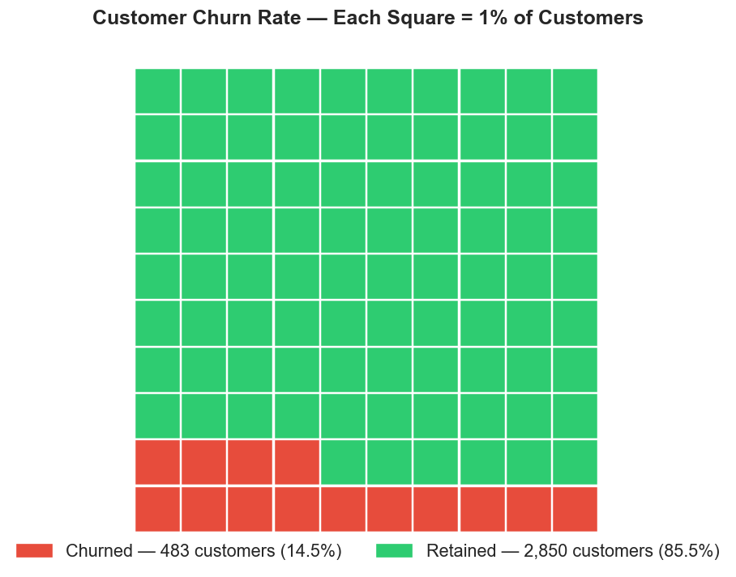
A waffle chart where each square represents 1% of customers. 14.5% of the customer base churned — manageable but commercially significant given acquisition costs.

### Feature Distributions — KDE
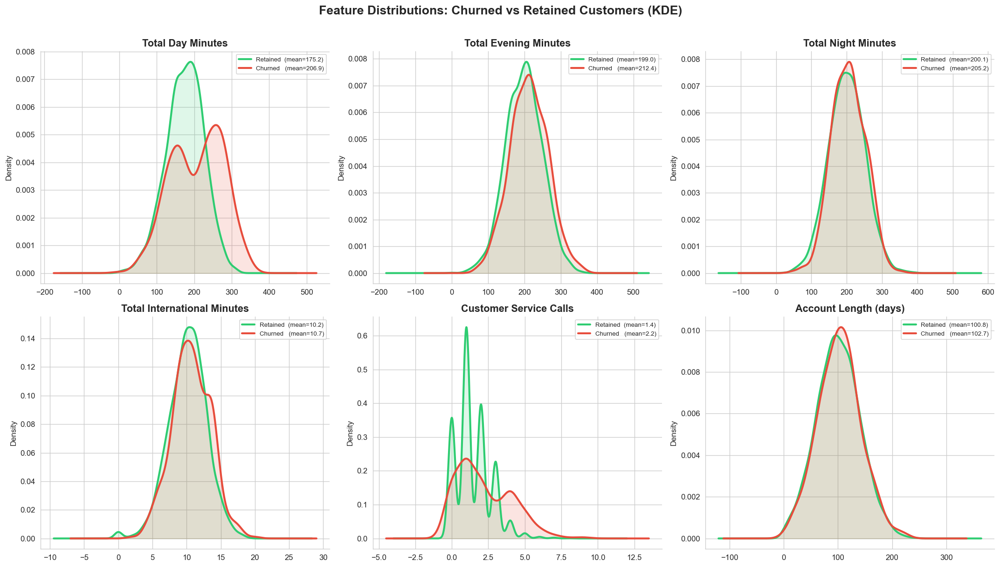
Kernel density plots comparing churned vs retained customers across six features:

- **Total Day Minutes**: Churned customers average 206.9 min vs 175.2 for retained — the clearest distributional gap of any usage feature.
- **Total Evening Minutes**: Slight churn shift (212.4 vs 199.0).
- **Total Night Minutes**: Nearly identical distributions (205.2 vs 200.1) — low predictive value.
- **Total International Minutes**: Minimal difference (10.7 vs 10.2).
- **Customer Service Calls**: Churned customers average 2.2 calls vs 1.4 for retained. The churned distribution has a heavy right tail — a key churn signal.
- **Account Length**: Virtually identical — tenure alone does not predict churn.

### Violin Plots — Usage by Time of Day 
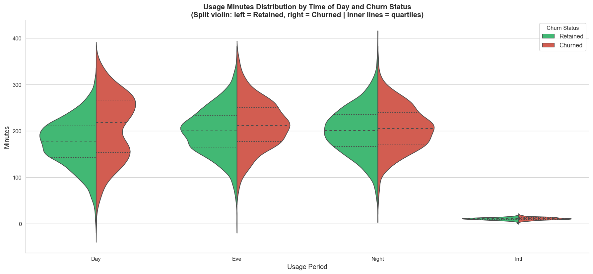
Split violins confirm that Day and Evening usage show meaningful distributional shifts between churned and retained groups. Night and International usage are nearly symmetric — those periods contribute little signal.

### Customer Service Calls vs Churn Rate 
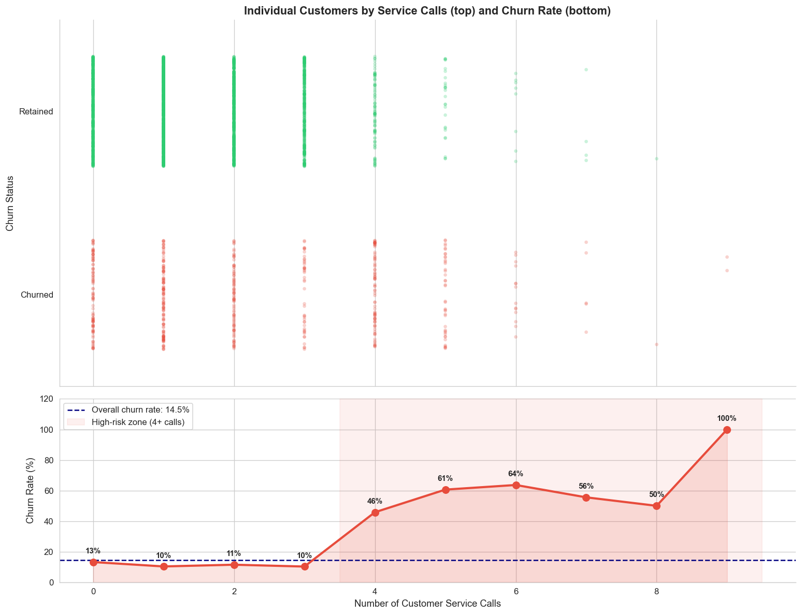
The most actionable finding in the EDA:

| Service Calls | Churn Rate |
|---|---|
| 0 | 13% |
| 1 | 10% |
| 2 | 11% |
| 3 | 10% |
| 4 | **46%** |
| 5 | **61%** |
| 6 | **64%** |
| 7 | **56%** |
| 8 | **50%** |
| 9 | **100%** |

Customers with 4+ service calls enter a high-risk zone where churn probability exceeds 46%. This threshold is a strong, actionable rule for early intervention.

### Pair Plot — Top Predictive Features 
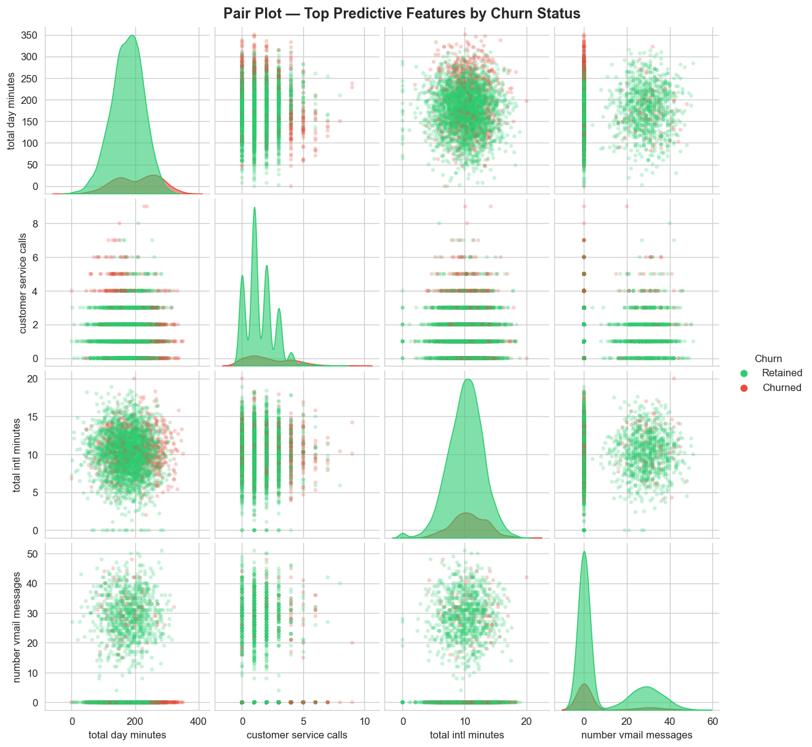
Pairwise scatter plots of the four most predictive features: total day minutes, customer service calls, total international minutes, and number of voicemail messages. Churned customers cluster at higher day minutes and service call values. Voicemail message count shows a bimodal retained distribution — likely reflecting voicemail plan adoption.

### Correlation Heatmap
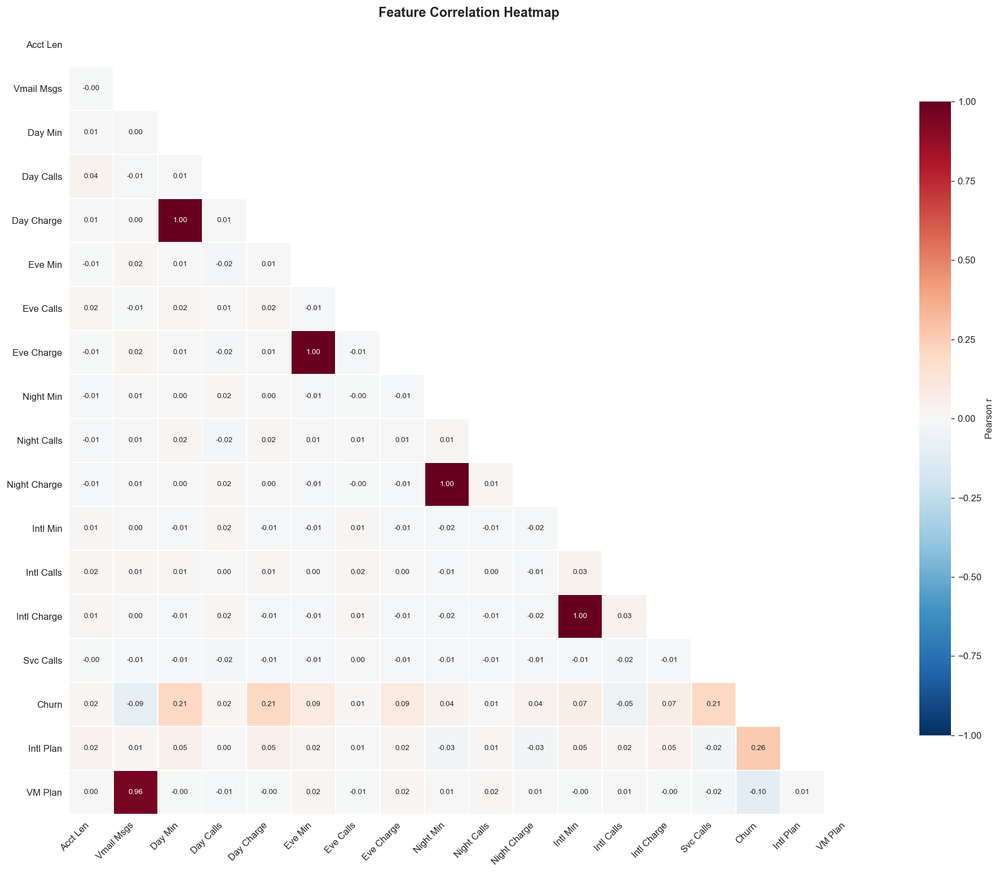
Key correlations with churn:
- **Day Minutes / Day Charge**: r = 0.21 (redundant — charge is a linear function of minutes)
- **Evening Minutes / Eve Charge**: r = 0.21 (same redundancy)
- **Customer Service Calls**: r = 0.21
- **International Plan**: r = 0.26
- **Voice Mail Plan**: r = −0.10 (slight protective effect)
- **Voicemail Messages ↔ VM Plan**: r = 0.96 — these two features are nearly collinear

Feature-to-feature correlations are otherwise very low, indicating minimal multicollinearity.

---

## Models

Five models were trained and evaluated. The business target was **recall ≥ 0.70** on the test set, prioritising the detection of churners over precision.

### M1: Logistic Regression (Baseline)
- Default settings, no class-weight adjustment
- **Test Recall: 0.247** — misses 73 of 97 churners
- Precision is decent but the model is heavily biased toward the majority class

### M2: Logistic Regression (Balanced, Tuned)
- Class weights balanced, threshold tuned
- **Test Recall: 0.742** ✓ — meets the business target
- Trade-off: 136 false positives (non-churners flagged)
- Train/test recall gap of only 0.022 — well generalised

### M3: Decision Tree (Baseline)
- Default max depth
- **Test Recall: 0.649** — just below target
- Train recall = 1.000 — severe overfitting (gap = 0.351)

### M4: Decision Tree (Tuned)
- Depth and leaf-size regularised
- **Test Recall: 0.742** ✓ — meets the business target
- AUC = 0.833, better than both LR models
- Train/test gap reduced to 0.196, though still notable

### M5: Random Forest — Final Model ✅
- Ensemble of regularised trees
- **Test Recall: 0.722** ✓
- **AUC: 0.882** — highest of all models
- Train recall = 0.859, gap = 0.130 — best generalisation of the tree-based models
- Average Precision (PR-AUC): 0.711

---

## Model Comparison

### Confusion Matrices

| Model | TN | FP | FN | TP | Recall | Precision |
|---|---|---|---|---|---|---|
| M1: LR Baseline | 549 | 21 | 73 | 24 | 0.247 | 0.533 |
| M2: LR Balanced | 434 | 136 | 25 | 72 | 0.742 | 0.346 |
| M3: DT Baseline | 540 | 30 | 34 | 63 | 0.649 | 0.677 |
| M4: DT Tuned | 525 | 45 | 25 | 72 | 0.742 | 0.615 |
| M5: RF Final | 512 | 58 | 27 | 70 | **0.722** | **0.547** |

### Recall Gap — Overfitting Comparison
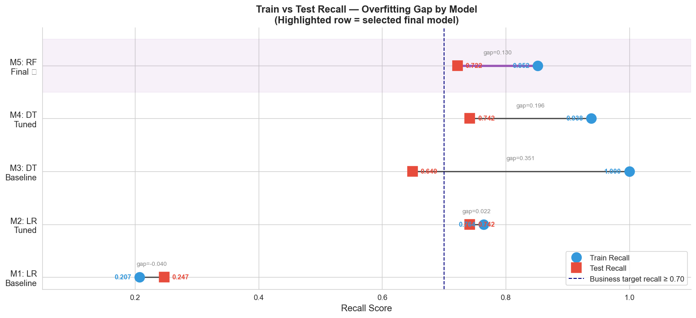
M5 Random Forest has the best balance: high test recall with the smallest train/test gap among tree-based models. M3 DT Baseline achieves perfect train recall but collapses on test data.

### Radar Chart 
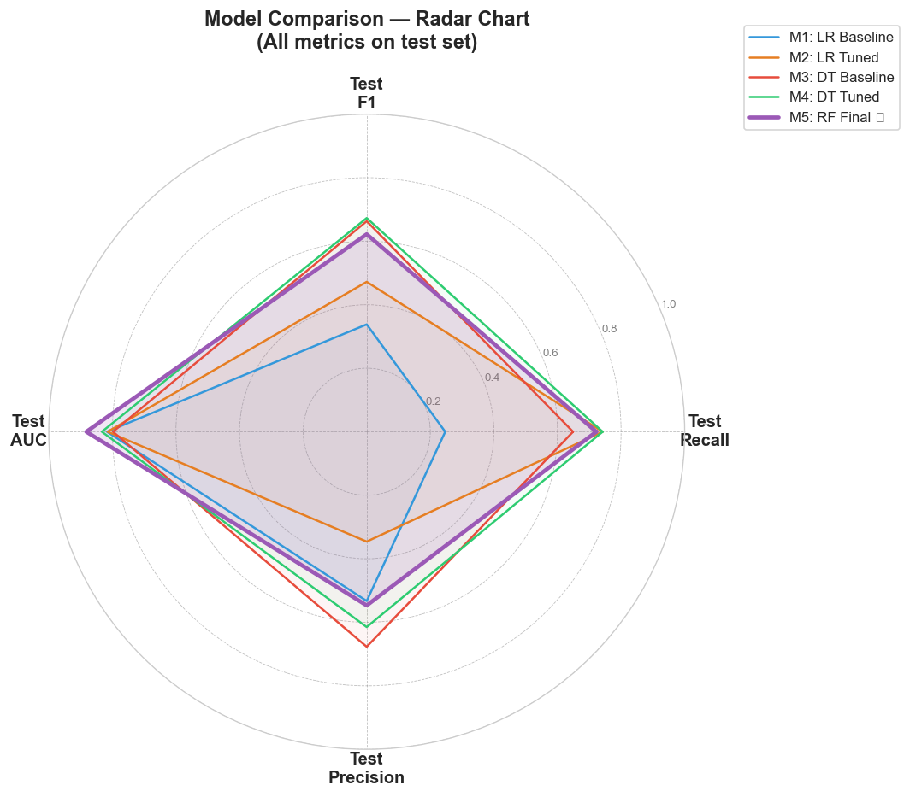
M5 RF dominates across F1, Recall, AUC, and Precision simultaneously. M2 LR Tuned achieves comparable recall but with much lower precision and AUC.

### ROC Curves 
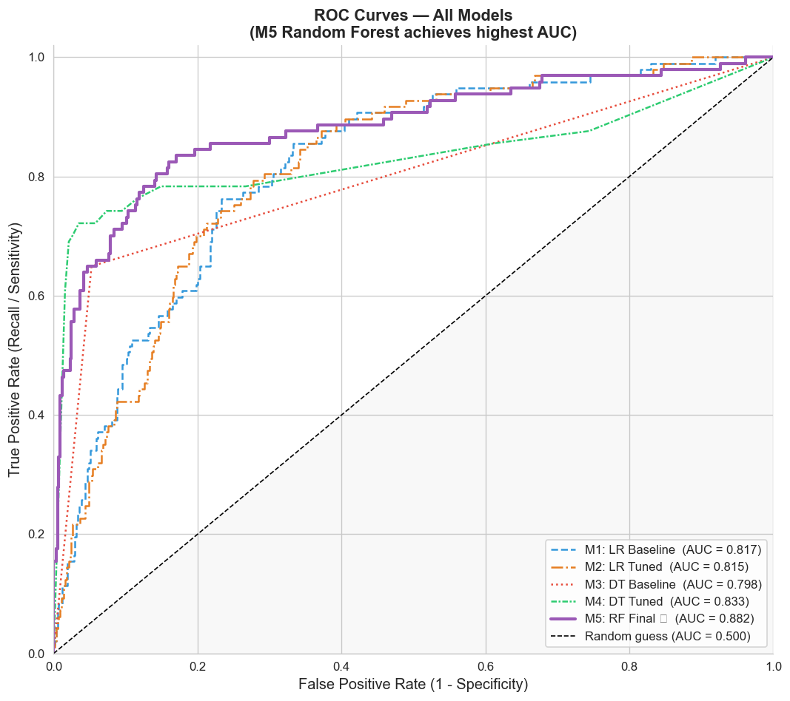

| Model | AUC |
|---|---|
| M5: RF Final | **0.882** |
| M4: DT Tuned | 0.833 |
| M1: LR Baseline | 0.817 |
| M2: LR Tuned | 0.815 |
| M3: DT Baseline | 0.798 |

### Precision-Recall Curve — M5 RF
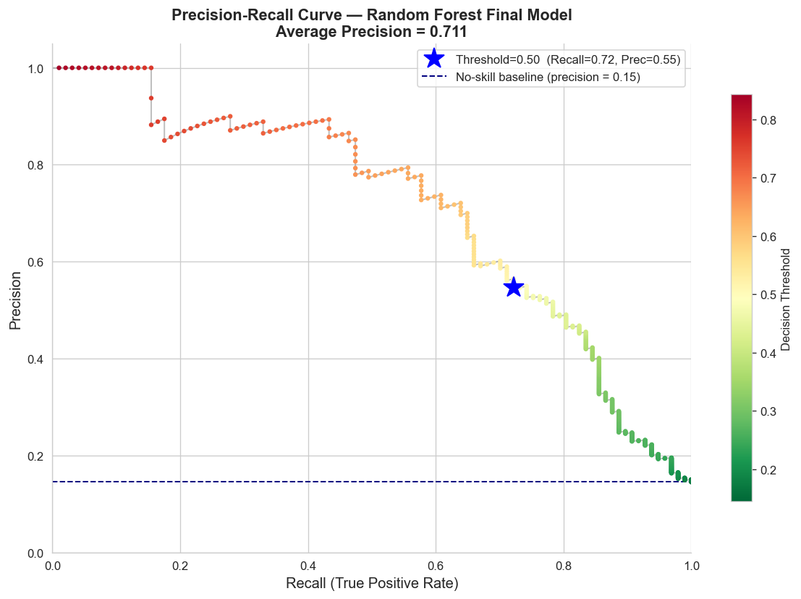
At the default threshold of 0.50: Recall = 0.72, Precision = 0.55. Lowering the threshold can increase recall at the cost of precision — appropriate if retention outreach is low-cost.

---

## Decision Tree Logic
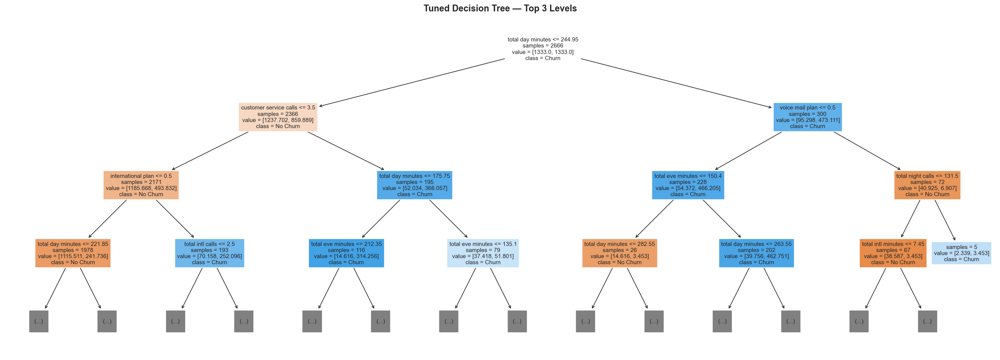

The tuned decision tree provides interpretable churn rules. Root split: **Total Day Minutes ≤ 244.95**.

- High day minutes (> 244.95) → check **Voice Mail Plan**: customers without it skew toward churn
- Low day minutes (≤ 244.95) → check **Customer Service Calls ≤ 3.5**:
  - Low service calls → check **International Plan** (no intl plan = predominantly retained)
  - High service calls (> 3.5) → near-certain churn territory regardless of other features

---

## Feature Importances — M5 Random Forest

### Lollipop Chart 
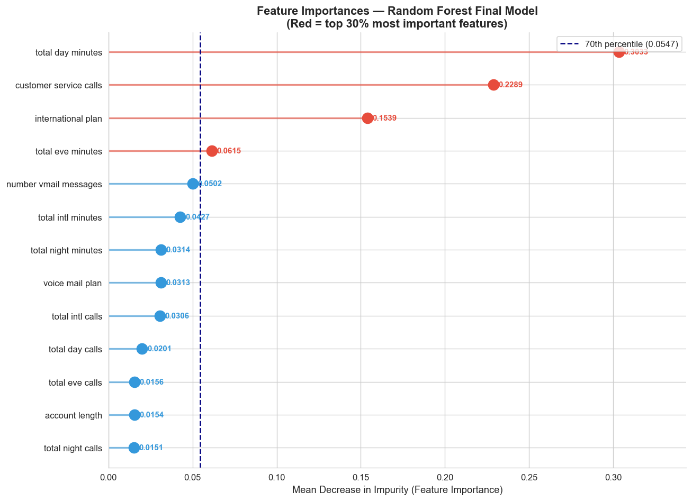 & Treemap 
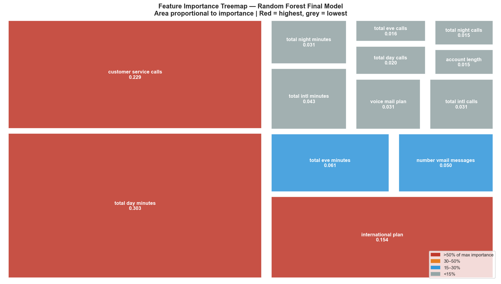
| Rank | Feature | Importance |
|---|---|---|
| 1 | Total Day Minutes | 0.303 |
| 2 | Customer Service Calls | 0.229 |
| 3 | International Plan | 0.154 |
| 4 | Total Evening Minutes | 0.062 |
| 5 | Number Voicemail Messages | 0.050 |
| 6 | Total International Minutes | 0.043 |
| 7 | Total Night Minutes | 0.031 |
| 8 | Voice Mail Plan | 0.031 |
| — | All others | < 0.031 each |

The top 3 features (day minutes, service calls, international plan) account for ~69% of total model importance.

---

## Key Business Insights

1. **High day usage is the single biggest churn signal.** Customers using 250+ daytime minutes should be monitored and potentially offered a better rate plan.

2. **Customer service calls ≥ 4 is a high-confidence churn trigger.** A real-time alert at the 4th call would catch roughly half of all churners before they leave.

3. **International plan customers churn at a disproportionately high rate.** Review international plan pricing and satisfaction — this cohort needs targeted outreach.

4. **Voicemail plan has a weak protective effect.** Encouraging voicemail plan adoption may marginally reduce churn, but is not a primary lever.

5. **Account tenure (length) has no predictive power.** Churn is driven by product/price friction, not how long someone has been a customer.

---

## Selected Model: M5 Random Forest

**Why M5 was chosen over M4 (DT Tuned) which had equal recall:**

- Higher AUC (0.882 vs 0.833) — better probability calibration across all thresholds
- Lower overfitting gap (0.130 vs 0.196) — more reliable on unseen data
- Higher average precision (PR-AUC 0.711) — better performance under class imbalance

**Deployment recommendation:** Use M5 RF with a threshold of ~0.40–0.45 if the business wants to increase recall above 0.72, accepting proportionally more false positives. At the current 0.50 threshold, roughly 1 in 2 flagged customers is a true churner — a strong signal for targeted retention campaigns.

---

## File Index

| File | Description |
|---|---|
| `visual_01_waffle_churn_rate.png` | Overall churn rate waffle chart |
| `visual_02_kde_usage_distributions.png` | KDE distributions: churned vs retained |
| `visual_03_violin_plots.png` | Usage by time of day — split violin plots |
| `visual_04_strip_service_calls.png` | Service calls vs churn rate |
| `visual_05_pair_plot.png` | Pair plot — top 4 predictive features |
| `visual_06_correlation_heatmap.png` | Feature correlation heatmap |
| `visual_07a–e_confusion_matrix.png` | Confusion matrices for M1–M5 |
| `visual_08_decision_tree.png` | Tuned decision tree — top 3 levels |
| `visual_09_dumbbell_recall_gap.png` | Train vs test recall gap by model |
| `visual_10_radar_chart.png` | Multi-metric model comparison radar |
| `visual_11_roc_curves.png` | ROC curves — all models |
| `visual_12_pr_curve.png` | Precision-recall curve — M5 RF |
| `visual_13_feature_importance_lollipop.png` | Feature importances — lollipop chart |
| `visual_14_feature_importance_treemap.png` | Feature importances — treemap |

### 5.2 Business Recommendations

**Recommendation 1 — Auto-Flag After the 3rd Service Call (Immediate)**
Churn jumps from ~11% to ~52% at 4+ calls. Route any customer logging a 3rd call to a senior retention agent before the 4th call occurs. This is a business rule — no model required to deploy it today.

**Recommendation 2 — Rate Cap Loyalty Offer for Heavy Daytime Users (Within 30 Days)**
Customers above the 75th percentile in daytime usage (> 216 min/day) are simultaneously your highest-value and highest-risk segment. Proactively offering a price guarantee removes the primary financial stressor driving their departure.

**Recommendation 3 — Audit the International Plan + Offer Voicemail as Incentive (Within 60 Days)**
42.4% of international plan holders churn — nearly 4× the base rate. Benchmark pricing against competitors and conduct exit interviews. Separately, offer the voicemail plan free as a trial to at-risk segments: holders churn at half the rate of non-holders.

### 5.3 Model Limitations

1. **27.8% of churners still missed** — recall of 72.2% means 1 in 4 churners are not flagged. The threshold can be lowered to catch more, but increases false positives and outreach cost.
2. **No demographic or contract data** — age, income, and contract type are known churn drivers but absent. Adding them is the highest-value next step.
3. **No timestamps — static snapshot** — the model cannot detect seasonal patterns or model churn as a time-to-event problem.
4. **Static model** — must be retrained as customer behaviour and competitive dynamics change. Quarterly retraining recommended.
5. **45% false positive rate among flagged** — budget approximately 0.8 non-churners contacted per genuine churner flagged.

### 5.4 Deployment Plan

| Phase | Timeline | Action |
|---|---|---|
| Phase 1 | Weeks 1–2 | Deploy weekly scoring pipeline to CRM; export priority-ranked at-risk list; set operating threshold with retention team |
| Phase 2 | Month 1–2 | Run A/B test — hold out a random control group; measure revenue retained vs outreach cost; tune threshold based on team capacity |
| Phase 3 | Quarterly | Retrain on newest data; add contract type and demographic features; target recall above 80% |

---

## 6. Repository Structure

```
├── churn_telecoms_dataset.csv              # Raw dataset
├── churn_telecoms_cleaned.csv              # Model-ready dataset (post-preparation)
├── telecom_churn_analysis_notebook.ipynb  # Full analysis notebook
├── README.md                              # This file
├── Telecom_Churn_Presentation_Final.pdf                       # Non-technical slide deck
└── .gitignore
```

| Tool | Purpose |
|---|---|
| Python 3 | Core language |
| pandas / NumPy | Data manipulation |
| Matplotlib / Seaborn | Visualisation |
| scikit-learn | Modelling, evaluation, GridSearchCV |
| squarify | Treemap visualisation |

---

## 7. Contributors

| Contributor | GitHub |
|---|---|
| Richard Oketch | [@richardoketch32806-eng](https://github.com/richardoketch32806-eng) |

---

*This README is the analytical bridge between the non-technical presentation slides and the full Jupyter Notebook. It does not reproduce code but provides the methodology, findings, and business context in depth. For implementation details, see `telecom_churn_analysis_notebook.ipynb`.*

